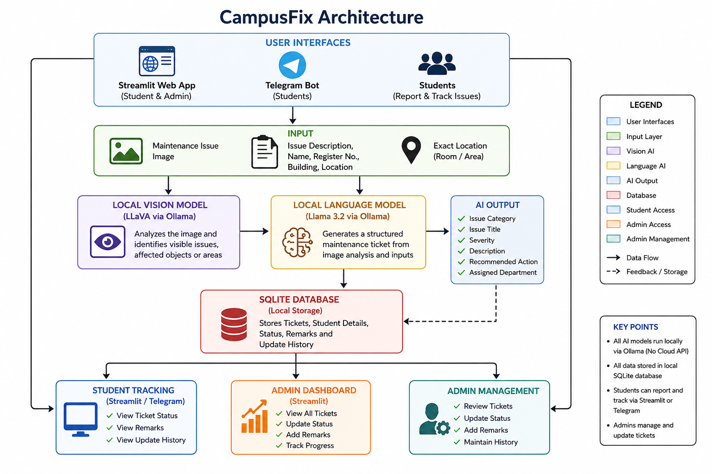
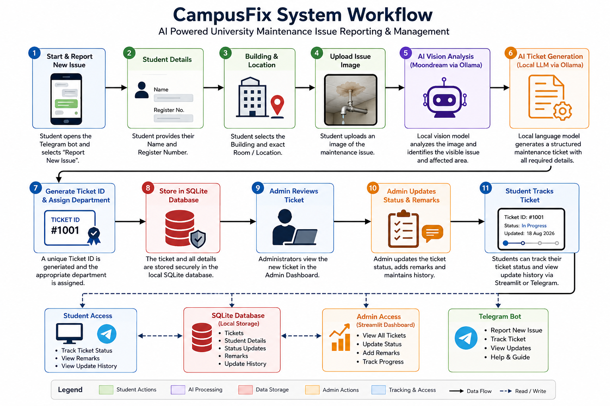
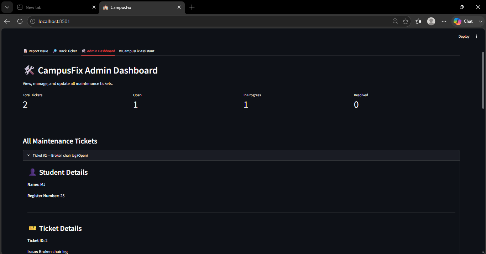

# CampusFix

## AI-Powered University Maintenance Issue Reporting System

CampusFix is a fully local AI-powered university maintenance issue reporting system designed to help students report campus infrastructure and maintenance problems efficiently.

Students can submit an image of an issue. Local AI models analyze the problem and automatically generate a structured maintenance ticket. The ticket is stored in a local SQLite database, where students can track its progress and administrators can manage and update it.

The system combines local image understanding, a local language model, a Streamlit web application, Telegram integration, and SQLite database management into a single workflow without relying on cloud AI APIs.

---

# Problem Statement

Universities and colleges often handle maintenance complaints manually through phone calls, written complaints, emails, or informal communication. This can create several problems:

- Students may not know which department should handle an issue.
- Maintenance requests may lack sufficient details.
- Administrators may find it difficult to track all complaints.
- Students may not receive updates about ticket progress.
- Important maintenance problems may be delayed or forgotten.

CampusFix addresses this problem by providing an AI-assisted maintenance reporting system where students can submit a photograph of an issue. The system analyzes the image, creates a structured maintenance ticket, routes it to the appropriate department, and allows both students and administrators to track ticket progress.

---

# Features

## Student Features

- Report a new maintenance issue.
- Enter student name and register number.
- Select a campus building and exact location.
- Upload an image of the maintenance problem.
- Receive an automatically generated Ticket ID.
- View ticket severity and assigned department.
- Track the current ticket status.
- View administrator remarks and ticket update history.

## AI Features

- Local image analysis using a vision model through Ollama.
- AI-based identification of visible maintenance issues.
- Analysis of affected objects or areas.
- Local ticket generation using a local language model through Ollama.
- Automatic generation of:
  - Issue category
  - Issue title
  - Severity
  - Description
  - Recommended action
  - Assigned department

## Administrator Features

- View all submitted maintenance tickets.
- Monitor total tickets.
- View Open, In Progress, and Resolved ticket counts.
- View complete issue information.
- Update ticket status.
- Add administrator remarks.
- Maintain ticket update history.

## Telegram Bot Features

- Report New Issue workflow.
- Student name and register number collection.
- Building and room selection.
- Image upload support.
- Local AI-based issue analysis.
- Automatic ticket creation.
- Ticket tracking.
- Update history display.
- Help and Guide section.
- `/cancel` command during operations.

---

# System Workflow

```text
Student
↓
Upload Maintenance Issue Image
↓
Local Vision Model via Ollama
↓
AI Image Analysis
↓
Local Language Model via Ollama
↓
Structured Maintenance Ticket
↓
SQLite Database
├── Streamlit Student Tracking
├── Admin Dashboard
└── Telegram Bot
```
---

# Step-by-Step Flow

1. A student uploads an image of a maintenance issue.
2. The student enters their name and register number.
3. The student selects the building and exact location.
4. The local vision model analyzes the uploaded image.
5. The system identifies the visible issue and affected object or area.
6. The local language model generates a structured maintenance ticket.
7. A unique Ticket ID is generated.
8. The appropriate maintenance department is assigned.
9. The ticket is stored in the local SQLite database.
10. Administrators review and update the ticket.
11. Students can track the ticket through the Streamlit application or Telegram bot.

---

# Architecture

CampusFix follows a modular architecture that connects student interfaces, local AI models, and the maintenance ticket management system.



# System Workflow

The following diagram shows how a maintenance issue moves through CampusFix, from image submission and AI analysis to ticket creation, administration, and tracking.


---

# Project Structure

```text
CampusFix/
│
├── README.md
├── LICENSE
├── .gitignore
├── requirements.txt
│
├── app.py                  # Streamlit application
├── telegram_bot.py         # Telegram bot
│
├── src/                    # Core application modules
│   ├── __init__.py
│   ├── vision_analyzer.py
│   ├── ticket_generator.py
│   ├── safety_checker.py
│   └── database.py
│
├── assets/                 # Application assets
│
├── docs/                   # Project documentation
│   ├── architecture.png
│   ├── workflow.png
│   └── screenshots/
│
├── models/                 # Local model-related files
├── data/                   # Local SQLite database
└── outputs/                # Generated application outputs
```
---

# Technologies Used

| Technology | Purpose |
|---|---|
| Python | Main programming language |
| Streamlit | Web application and dashboards |
| Ollama | Local AI model execution |
| Local Vision Model | Maintenance issue image understanding |
| Local LLM | Structured maintenance ticket generation |
| SQLite | Ticket and update database |
| python-telegram-bot | Telegram integration |
| Pillow | Image handling |

---

# Local AI Models

CampusFix uses local AI models through Ollama.

## Vision Model

The local vision model analyzes the uploaded maintenance issue image and identifies visible maintenance-related problems.

The configured model can be checked in:

src/vision_analyzer.py

## Text Model

The local language model uses the image analysis and location information to generate a structured maintenance ticket.

The configured model can be checked in:

src/ticket_generator.py

No OpenAI, Gemini, Claude, or other cloud AI API is required for the core AI workflow.

---

# Installation

## 1. Clone the Repository

git clone https://github.com/manojjairam/CampusFix.git

cd CampusFix

## 2. Create a Virtual Environment

For Windows PowerShell:

py -3.12 -m venv .venv

Activate the virtual environment:

.\.venv\Scripts\Activate.ps1

For Windows Command Prompt:

.venv\Scripts\activate

## 3. Install Python Dependencies

pip install -r requirements.txt

---

# Install Ollama

Install Ollama on your local machine.

After installation, verify it using:

ollama --version

---

# Download Required Local Models

Download the local models required by the project using Ollama.

Use the exact model names configured in:

src/vision_analyzer.py

and:

src/ticket_generator.py

For example:

ollama pull <vision-model-name>

ollama pull <text-model-name>

Verify that the models are available:

ollama list

---

# Usage

## Start the Streamlit Application

Activate the virtual environment:

.\.venv\Scripts\Activate.ps1

Run the application:

streamlit run app.py

The application will open locally in your browser.

---

## Start the Telegram Bot

Open another terminal inside the CampusFix project directory.

Activate the virtual environment:

.\.venv\Scripts\Activate.ps1

Run:

python telegram_bot.py

The Telegram bot and Streamlit application use the same local SQLite database.

---

# Example Ticket

Student Details

Name: Student Name
Register Number: 123456

Ticket Details

Ticket ID: 1
Issue: Faulty Ceiling Fan
Category: Electrical Maintenance
Severity: High
Created: 17 Aug 2026, 19:30:45

Ticket directed to: Electrical Maintenance

---

# Ticket Status Flow

Open
↓
In Progress
↓
Resolved

Administrators can add remarks whenever a ticket is updated. Students can later view the current status and complete update history.

---

# Database

CampusFix uses SQLite for local data storage.

The database stores:

- Student name
- Register number
- Ticket ID
- Issue category
- Issue title
- Severity
- Description
- Recommended action
- Assigned department
- Building
- Room
- Ticket status
- Creation date and time
- Administrator remarks
- Ticket update history

The database is stored locally inside the `data/` directory.

---

# Screenshots

## Student Issue Reporting


Students can enter their details, select the campus location, and upload an image of the maintenance issue.

## AI-Generated Ticket


CampusFix analyzes the issue using local AI models and automatically generates a structured maintenance ticket.

## Ticket Tracking


Students can use their Ticket ID to view the current status and ticket details.

## Admin Dashboard



Administrators can view submitted maintenance tickets and monitor their status.

## Ticket Management


Administrators can update ticket status, add remarks, and maintain the ticket history.

## Telegram Bot


Students can report maintenance issues and track tickets through the Telegram bot.

---

# Demo Video

The project demonstration video is stored at:

demo/demo.mp4

The demo demonstrates:

1. Starting the Streamlit application.
2. Reporting a maintenance issue.
3. Uploading an image.
4. Local AI image analysis.
5. Local AI ticket generation.
6. Ticket creation and storage.
7. Viewing the ticket in the Admin Dashboard.
8. Updating the ticket status.
9. Tracking the updated ticket.
10. Using the Telegram bot.

---

# Privacy and Local Processing

CampusFix is designed with local AI processing.

- The vision model runs locally through Ollama.
- The language model runs locally through Ollama.
- Ticket information is stored in a local SQLite database.
- No cloud AI API is required for the core AI workflow.

This allows the project to run on a local machine while keeping the AI processing and ticket data within the local environment.

---

# Future Enhancements

Possible future improvements include:

- Automatic notification when ticket status changes.
- Department-specific administrator accounts.
- Automatic technician assignment.
- Priority-based maintenance queues.
- Analytics and reporting dashboard.
- Email notifications.
- Campus maintenance statistics.
- Improved computer vision and object detection models.
- Authentication and role-based access.
- Mobile application integration.

---

# Demo

CampusFix demonstrates a university-focused AI application with the following workflow:

Image Input
+
Student Details + Location
↓
Local Vision AI
↓
Local Language Model
↓
Structured Maintenance Ticket
↓
SQLite Storage
↓
Admin Management
↓
Student Tracking
+
Telegram Integration

---

# Author

Developed as an academic project for an AI-powered university maintenance issue reporting system.

---

# License

This project is licensed under the MIT License. See the `LICENSE` file for details.
