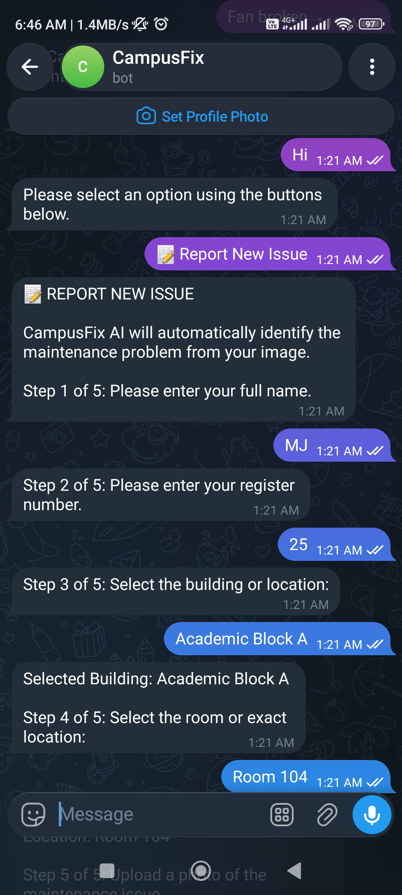
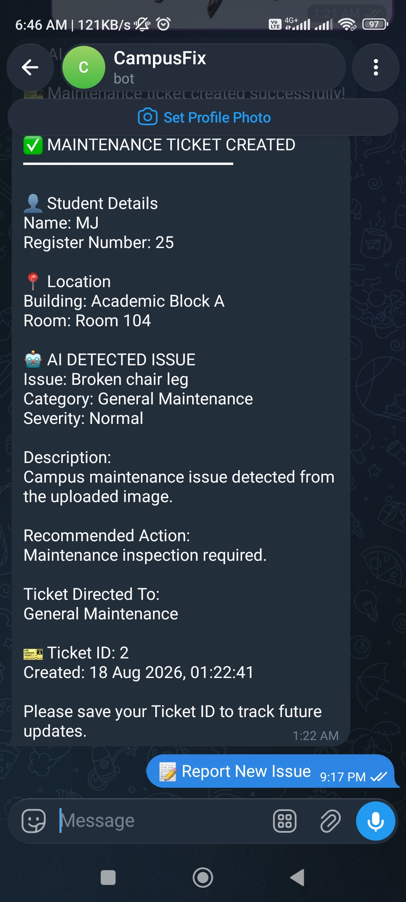
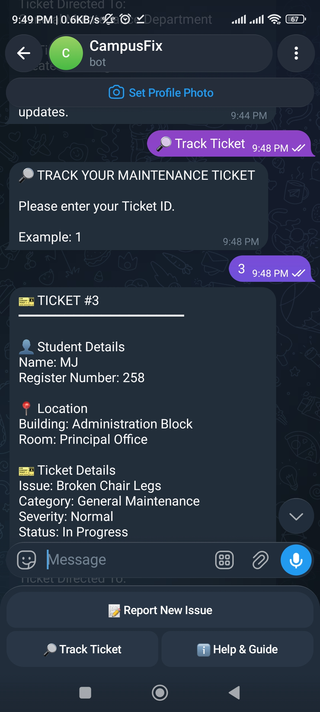
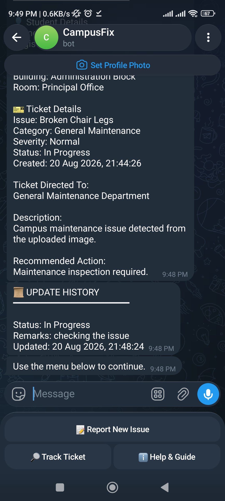

# CampusFix

## AI-Powered University Maintenance Issue Reporting System

CampusFix is a fully local AI-powered university maintenance issue reporting system designed to help students report campus infrastructure and maintenance problems efficiently.

Students can submit an image of an issue along with their details and location. Local AI models analyze the problem and automatically generate a structured maintenance ticket. The ticket is stored in a local SQLite database, where students can track its progress and administrators can manage and update it.

The system combines local image understanding, a local language model, a Streamlit web application, Telegram integration, and SQLite database management into a single workflow without relying on cloud AI APIs.

---

# Problem Statement

Universities and colleges often handle maintenance complaints manually through phone calls, written complaints, emails, or informal communication. This can create several problems:

- Students may not know which department should handle an issue.
- Maintenance requests may lack sufficient details.
- Administrators may find it difficult to track all complaints.
- Students may not receive updates about ticket progress.
- Important maintenance problems may be delayed or forgotten.

CampusFix addresses this problem by providing an AI-assisted maintenance reporting system where students can submit a photograph of an issue. The system analyzes the image, creates a structured maintenance ticket, routes it to the appropriate department, and allows both students and administrators to track ticket progress.

---

# Features

## Student Features

- Report a new maintenance issue.
- Enter student name and register number.
- Select a campus building and exact location.
- Upload an image of the maintenance problem.
- Receive an automatically generated Ticket ID.
- View ticket severity and assigned department.
- Track the current ticket status.
- View administrator remarks and ticket update history.

## AI Features

- Local image analysis using a vision model through Ollama.
- AI-based identification of visible maintenance issues.
- Analysis of affected objects or areas.
- Local ticket generation using a local language model through Ollama.
- Automatic generation of:
  - Issue category
  - Issue title
  - Severity
  - Description
  - Recommended action
  - Assigned department

## Administrator Features

- View all submitted maintenance tickets.
- Monitor total tickets.
- View Open, In Progress, and Resolved ticket counts.
- View complete issue information.
- Update ticket status.
- Add administrator remarks.
- Maintain ticket update history.

## Telegram Bot Features

- Report New Issue workflow.
- Student name and register number collection.
- Building and room selection.
- Image upload support.
- Local AI-based issue analysis.
- Automatic ticket creation.
- Ticket tracking.
- Update history display.
- Help and Guide section.
- `/cancel` command during operations.

---

# System Workflow

```text
Student
   │
   ▼
Upload Maintenance Issue Image
+ Student Details + Location
   │
   ▼
Local Vision Model via Ollama
   │
   ▼
AI Image Analysis
   │
   ▼
Local Language Model via Ollama
   │
   ▼
Structured Maintenance Ticket
   │
   ▼
SQLite Database
   │
   ├── Streamlit Student Tracking
   ├── Admin Dashboard
   └── Telegram Bot
```

---

# Step-by-Step Flow

1. A student opens CampusFix through the Streamlit application or Telegram bot.
2. The student chooses to report a new maintenance issue.
3. The student enters their name and register number.
4. The student selects the campus building and exact location.
5. The student uploads an image of the maintenance issue.
6. The local vision model analyzes the uploaded image.
7. The system identifies the visible issue and affected object or area.
8. The local language model processes the AI analysis and available issue information.
9. A structured maintenance ticket is generated automatically.
10. A unique Ticket ID is generated.
11. The appropriate maintenance department is assigned.
12. The ticket is stored in the local SQLite database.
13. Administrators review the submitted ticket.
14. Administrators update the ticket status and add remarks.
15. Students can track the current status and update history through the Streamlit application or Telegram bot.

---

# Architecture

CampusFix follows a modular architecture.

```text
                    ┌──────────────────────┐
                    │       STUDENT        │
                    │ Streamlit / Telegram │
                    └──────────┬───────────┘
                               │
                               ▼
                    ┌──────────────────────┐
                    │     IMAGE INPUT      │
                    │ Student + Location   │
                    └──────────┬───────────┘
                               │
                               ▼
                    ┌──────────────────────┐
                    │ LOCAL VISION MODEL   │
                    │     VIA OLLAMA       │
                    │ Image Issue Analysis │
                    └──────────┬───────────┘
                               │
                               ▼
                    ┌──────────────────────┐
                    │ LOCAL LANGUAGE MODEL │
                    │     VIA OLLAMA       │
                    │  Ticket Generation   │
                    └──────────┬───────────┘
                               │
                               ▼
                    ┌──────────────────────┐
                    │   SQLITE DATABASE    │
                    │ Tickets and Updates  │
                    └──────────┬───────────┘
                               │
              ┌────────────────┼────────────────┐
              ▼                ▼                ▼
       ┌─────────────┐  ┌─────────────┐  ┌──────────────┐
       │  Streamlit  │  │  Telegram   │  │    Admin     │
       │  Dashboard  │  │     Bot     │  │  Management  │
       └─────────────┘  └─────────────┘  └──────────────┘
```

A visual architecture diagram is available at:

`docs/architecture.png`

The workflow diagram is available at:

`docs/workflow.png`

---

# Project Structure

```text
CampusFix/
│
├── README.md
├── LICENSE
├── .gitignore
├── requirements.txt
│
├── app.py
├── telegram_bot.py
│
├── src/
│   ├── __init__.py
│   ├── vision_analyzer.py
│   ├── ticket_generator.py
│   ├── database.py
│   └── safety_checker.py
│
├── assets/
│
├── docs/
│   ├── architecture.png
│   ├── workflow.png
│   └── screenshots/
│
├── models/
│
├── data/
│   └── campusfix.db
│
└── outputs/
```

> Note: The SQLite database is created locally when the application runs if it does not already exist.

---

# Technologies Used

| Technology | Purpose |
|---|---|
| Python | Main programming language |
| Streamlit | Web application and dashboards |
| Ollama | Local AI model execution |
| Local Vision Model | Maintenance issue image understanding |
| Local LLM | Structured maintenance ticket generation |
| SQLite | Ticket and update database |
| python-telegram-bot | Telegram integration |
| Pillow | Image handling |

---

# Prerequisites

Before installing CampusFix, make sure the following software is available on your computer:

1. Python 3.10 or later
2. Git
3. Ollama
4. A stable internet connection for the initial download of Python packages and Ollama models

After the required models are downloaded, the core AI workflow runs locally through Ollama.

---

# Installation

## Step 1: Install Git

Install Git on your computer if it is not already installed.

To verify the installation, open Command Prompt or PowerShell and run:

```powershell
git --version
```

If a version number is displayed, Git is installed correctly.

---

## Step 2: Install Python

Install Python 3.10 or later.

To verify Python, open Command Prompt or PowerShell and run:

```powershell
python --version
```

or:

```powershell
py --version
```

If a Python version is displayed, Python is installed correctly.

---

## Step 3: Clone the Repository

Open PowerShell or Command Prompt.

Move to the location where you want to save the project. For example:

```powershell
cd Documents
```

Clone the repository:

```powershell
git clone https://github.com/manojjairam/CampusFix.git
```

Move into the project folder:

```powershell
cd CampusFix
```

You should now be inside the CampusFix project directory.

---

## Step 4: Create a Virtual Environment

A virtual environment keeps the project's Python packages separate from other projects.

For Windows PowerShell, run:

```powershell
py -3.12 -m venv .venv
```

If Python 3.12 is not installed but another supported Python version is available, use:

```powershell
python -m venv .venv
```

---

## Step 5: Activate the Virtual Environment

### Windows PowerShell

Run:

```powershell
.\.venv\Scripts\Activate.ps1
```

After activation, you should see something similar to:

```text
(.venv) C:\Users\YourName\Documents\CampusFix>
```

### Windows Command Prompt

Run:

```cmd
.venv\Scripts\activate
```

---

## Step 6: Install Python Dependencies

Make sure the virtual environment is activated.

Then run:

```powershell
pip install -r requirements.txt
```

Wait until all required packages are installed.

---

# Install Ollama

CampusFix uses Ollama to run AI models locally.

Install Ollama on your computer.

After installation, open a new terminal and verify that Ollama is installed:

```powershell
ollama --version
```

If a version number is displayed, Ollama is installed correctly.

---

# Download the Required Local AI Models

CampusFix uses local models configured in the project source code.

The vision model configuration can be checked in:

`src/vision_analyzer.py`

The text model configuration can be checked in:

`src/ticket_generator.py`

Open those files and check the configured Ollama model names.

Then download the required models using:

```powershell
ollama pull <vision-model-name>
```

and:

```powershell
ollama pull <text-model-name>
```

For example, if your configured models are `llava:latest` and `llama3.2:3b`, run:

```powershell
ollama pull llava:latest
```

```powershell
ollama pull llama3.2:3b
```

After downloading the models, verify them:

```powershell
ollama list
```

The downloaded models should appear in the list.

---

# Running the Application

## Step 1: Open the Project Directory

Open PowerShell or Command Prompt and move into the CampusFix folder:

```powershell
cd path\to\CampusFix
```

For example:

```powershell
cd C:\Users\YourName\Documents\CampusFix
```

---

## Step 2: Activate the Virtual Environment

For PowerShell:

```powershell
.\.venv\Scripts\Activate.ps1
```

For Command Prompt:

```cmd
.venv\Scripts\activate
```

---

## Step 3: Start the Streamlit Application

Run:

```powershell
streamlit run app.py
```

Streamlit will display a local URL in the terminal, usually:

```text
http://localhost:8501
```

Open the displayed URL in your web browser if it does not open automatically.

You can now use the CampusFix web application.

---

# How to Report a Maintenance Issue

Once the Streamlit application is running:

1. Open the CampusFix application in your browser.
2. Navigate to the issue reporting section.
3. Enter the student name.
4. Enter the register number.
5. Select the building.
6. Select or enter the exact location.
7. Upload an image showing the maintenance issue.
8. Submit the issue.
9. Wait while the local AI models analyze the image and generate the ticket.
10. Note the generated Ticket ID.
11. Use the Ticket ID later to track the issue.

The system analyzes the issue locally and generates structured information such as:

- Issue category
- Issue title
- Severity
- Description
- Recommended action
- Assigned department

---

# How to Track a Ticket

To track an existing maintenance request:

1. Open the CampusFix application.
2. Navigate to the ticket tracking section.
3. Enter the Ticket ID.
4. View the current ticket information.
5. Check the current status.
6. View administrator remarks, if available.
7. View the ticket update history.

---

# Administrator Workflow

Administrators can manage submitted maintenance requests through the Admin Dashboard.

The administrator workflow is:

1. Open the Admin Dashboard.
2. View all submitted tickets.
3. Review the issue information generated by the AI workflow.
4. Check the assigned department and severity.
5. Update the ticket status.
6. Add administrator remarks.
7. Save the update.
8. The update history is stored in the SQLite database.
9. Students can later view the updated status through ticket tracking.

---

# Ticket Status Flow

```text
Open
  │
  ▼
In Progress
  │
  ▼
Resolved
```

Administrators can add remarks whenever a ticket is updated. Students can later view the current status and complete update history.

---

# Running the Telegram Bot

The Telegram bot is optional and can be started separately.

## Step 1: Open Another Terminal

Keep the Streamlit application running.

Open another PowerShell or Command Prompt window.

Move into the CampusFix project directory:

```powershell
cd path\to\CampusFix
```

For example:

```powershell
cd C:\Users\YourName\Documents\CampusFix
```

---

## Step 2: Activate the Virtual Environment

For PowerShell:

```powershell
.\.venv\Scripts\Activate.ps1
```

For Command Prompt:

```cmd
.venv\Scripts\activate
```

---

## Step 3: Configure the Telegram Bot

The Telegram bot requires a valid Telegram Bot Token.

Configure the token according to the implementation in:

`telegram_bot.py`

Do not publish a real Telegram Bot Token in a public repository.

For security, use environment variables or another local configuration method if you plan to share the repository publicly.

---

## Step 4: Start the Bot

Run:

```powershell
python telegram_bot.py
```

If the bot starts successfully, you can interact with it through Telegram.

The Telegram bot and Streamlit application use the same local SQLite database.

---

# Example Ticket

```text
Student Details

Name: Student Name
Register Number: 123456

Ticket Details

Ticket ID: 1
Issue: Faulty Ceiling Fan
Category: Electrical Maintenance
Severity: High
Created: 17 Aug 2026, 19:30:45

Assigned Department: Electrical Maintenance
Status: Open
```

---

# Database

CampusFix uses SQLite for local data storage.

The database stores:

- Student name
- Register number
- Ticket ID
- Issue category
- Issue title
- Severity
- Description
- Recommended action
- Assigned department
- Building
- Room or location
- Ticket status
- Creation date and time
- Administrator remarks
- Ticket update history

The database is stored locally inside the `data/` directory.

Because SQLite is used, a separate database server installation is not required.

---

# Architecture and Workflow Diagrams

The project includes the following documentation diagrams.

## System Architecture

This diagram shows the overall system architecture and communication between the user interfaces, local AI models, and database.


## System Workflow

This diagram shows the end-to-end workflow from image submission to AI analysis, ticket creation, database storage, administration, and ticket tracking.


---

# Screenshots

The following screenshots demonstrate the main features and workflow of CampusFix.

## 1. Student Issue Reporting

Students can enter their details, select the building and location, and upload an image of the maintenance issue.



---

## 2. AI Image Analysis and Ticket Generation

The uploaded maintenance issue image is analyzed using the local vision model, and the local language model generates a structured maintenance ticket.



---

## 3. Administrator Dashboard

Administrators can view submitted maintenance tickets, monitor ticket counts, review issue details, and manage ticket status.


---

## 6. Telegram Bot - Ticket Tracking

Students can track their submitted maintenance tickets and view ticket status and update history through the Telegram bot.





---

# 🎥 Demo Video

Watch the complete CampusFix demonstration below.

The video demonstrates:

- Student issue reporting
- Image upload
- Local AI image analysis
- Automatic maintenance ticket generation
- Ticket creation
- Ticket tracking

[▶️ Watch the CampusFix Demo Video](https://github.com/manojjairam/CampusFix/blob/main/docs/campusfix_demo.mp4)
---

# Privacy and Local Processing

CampusFix is designed around local AI processing.

- The vision model runs locally through Ollama.
- The language model runs locally through Ollama.
- Ticket information is stored in a local SQLite database.
- No OpenAI, Gemini, Claude, or other cloud AI API is required for the core AI workflow.

This allows the project to run on a local machine while keeping the core AI processing and ticket data within the local environment.

---

# Troubleshooting

## `python` or `py` command is not recognized

Python may not be installed correctly or may not be added to the system PATH.

Reinstall Python and ensure the option to add Python to PATH is enabled during installation.

---

## Virtual Environment Cannot Be Activated in PowerShell

If PowerShell blocks the activation script, you may need to allow local scripts for the current user.

Run PowerShell and use:

```powershell
Set-ExecutionPolicy -ExecutionPolicy RemoteSigned -Scope CurrentUser
```

Then close and reopen PowerShell and try:

```powershell
.\.venv\Scripts\Activate.ps1
```

---

## `ollama` Command Is Not Recognized

Make sure Ollama is installed correctly.

Close and reopen the terminal after installation, then run:

```powershell
ollama --version
```

---

## AI Model Is Not Found

Check the available local models:

```powershell
ollama list
```

If the required model is missing, download it using:

```powershell
ollama pull <model-name>
```

Use the exact model name configured in the CampusFix source files.

---

## Streamlit Command Is Not Recognized

Make sure the virtual environment is activated and dependencies have been installed:

```powershell
pip install -r requirements.txt
```

You can also try:

```powershell
python -m streamlit run app.py
```

---

## Application Cannot Connect to a Local AI Model

Check that Ollama is installed and running.

Verify that the required models are available:

```powershell
ollama list
```

Also verify that the model names in the project source code match the downloaded model names.

---

# Future Enhancements

Possible future improvements include:

- Automatic notification when ticket status changes.
- Department-specific administrator accounts.
- Automatic technician assignment.
- Priority-based maintenance queues.
- Analytics and reporting dashboard.
- Email notifications.
- Campus maintenance statistics.
- Improved computer vision and object detection models.
- Authentication and role-based access.
- Mobile application integration.

---

# Summary

CampusFix demonstrates a university-focused AI workflow that combines local image understanding, local language processing, ticket generation, database storage, administration, and student tracking.

```text
Image Input
      +
Student Details + Location
      │
      ▼
Local Vision AI
      │
      ▼
Local Language Model
      │
      ▼
Structured Maintenance Ticket
      │
      ▼
SQLite Storage
      │
      ▼
Admin Management
      │
      ▼
Student Tracking
      +
Telegram Integration
```

---

# Author

Developed as an academic project for an AI-powered university maintenance issue reporting system.

---

# License

This project is licensed under the MIT License. See the `LICENSE` file for details.
